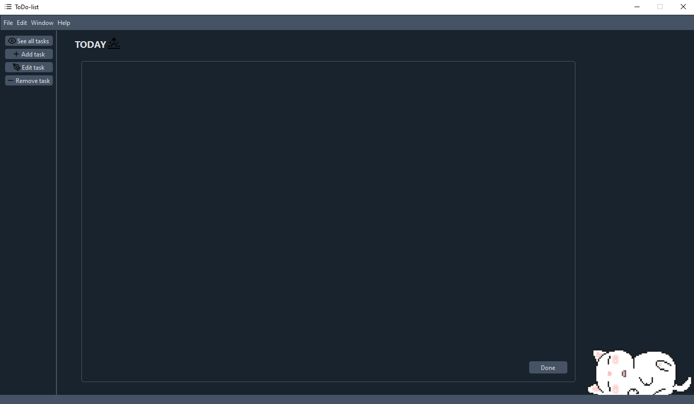

# ToDo-list
Consiste em uma lista de afazeres que ajuda o usuário a controlar suas tarefas e datas importantes.

## Adicionar
* Para adicionar algo, a data deve seguir o formato data, mês e ano, respectivamente separados por "/", ".", " " ou "-".
* O termo "today" pode ser usado para colocar a data atual.
* O título deve ser único.

## Remover
* Selicione e remova um item na janela de remoção.

## Editar
* Permite mudar a data e descrição de uma tarefa já registrada.

## Ver tudo
* Mostra todas as tarefas, seus títulos, datas limites e descrições.

## Tarefas do dia
* As tarefas que tem data limite no dia presente, serão apresentadas na home page e quando concluídas podem ser removidas pelo botão "Done".

## Barra de menu
* Window > Preferences > Modo claro, modo escuro e modo transparente.
* Help > redireciona para este README.