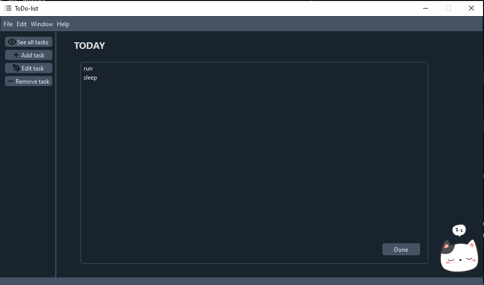

# ToDo-list
Consiste em uma lista de afazeres que ajuda o usuário a controlar suas tarefas e datas importantes.

## Adicionar
* Para adicionar algo, a data deve seguir o formato DD/MM/YY, DD-MM-YY, DD MM YY ou DD.MM.YY.
* O título deve ser único.

## Remover
> a ser implementado

## Editar
> a ser implementado

## Ver tudo
* Mostra todas as tarefas, seus títulos, datas limites e descrições.

## Tarefas do dia
* As tarefas que tem data limite no dia presente, serão apresentadas na home page e quando concluídas podem ser removidas pelo botão "Done".